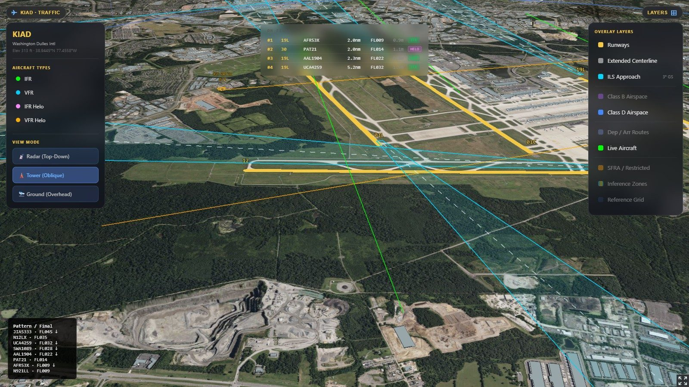
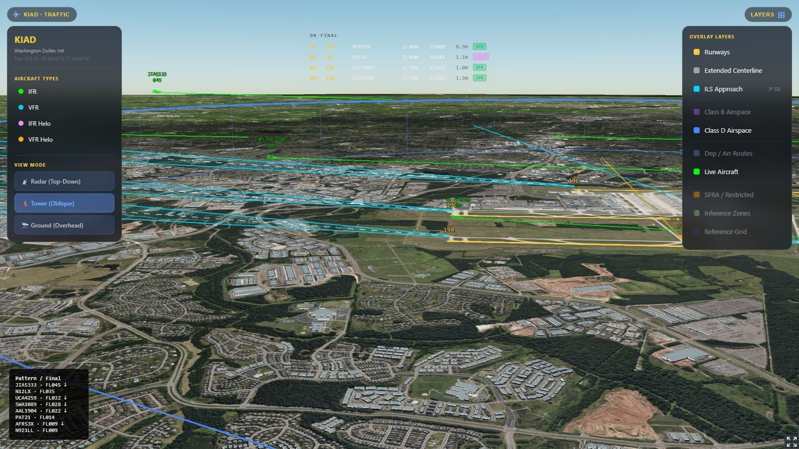
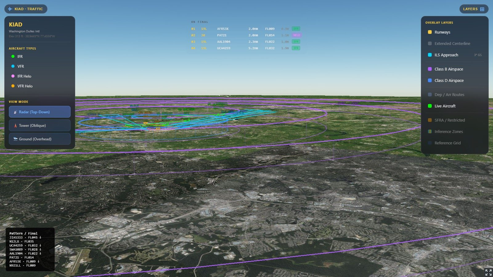
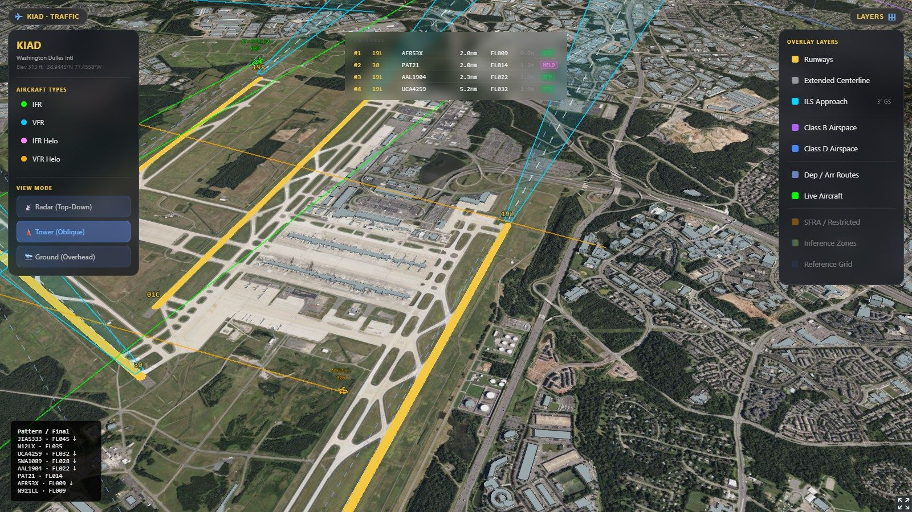
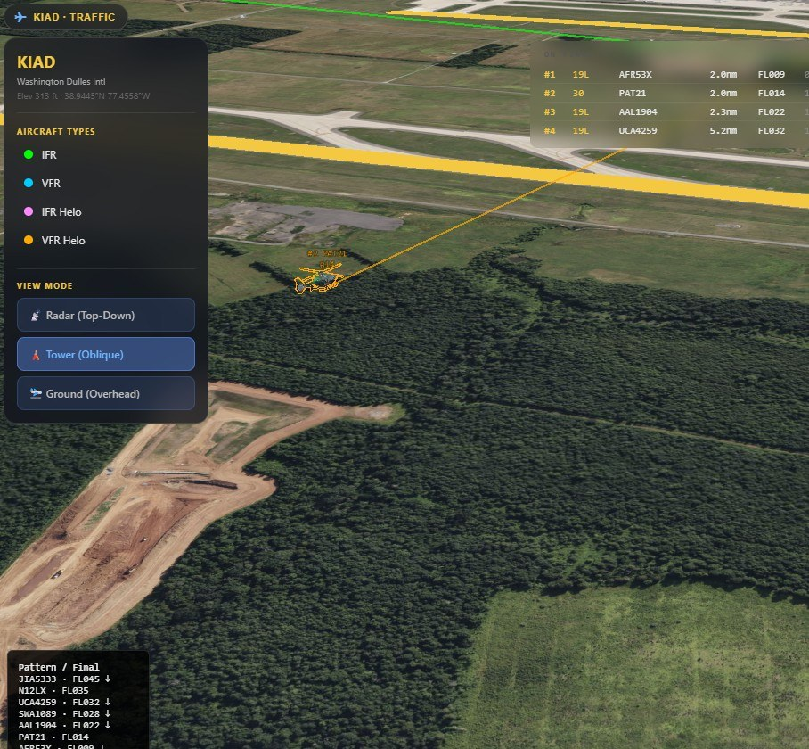

# KIAD Geospatial Viz

**Author:** Jose I. Montero

Real-time **geospatial visualization** and **UI systems** demo centered on Washington Dulles (KIAD).
A CesiumJS / WebGL client composites photorealistic 3D tiles, terrain, and live traffic entities with
toggleable airspace overlays, camera modes, and conflict highlighting — aviation is the problem domain;
the engineering focus is rendering, data plumbing, and interactive layers.

Built on [CesiumJS](https://cesium.com/platform/cesiumjs/) with a small Python service that
proxies and normalizes live ADS-B feeds for the browser.



*Oblique camera over KIAD with approach geometry, live entities, and control panels.
Photorealistic 3D tiles and Cesium terrain require `CESIUM_TOKEN` and `GOOGLE_KEY` in a local `.env` — see [Configuration](#configuration--api-keys).*

### Screenshots

| | |
|:--|:--|
|  |  |
| *Entities on final with 3° approach geometry* | *Shelved Class B airspace rings* |
|  |  |
| *Layer toggles (runways, approaches, airspace, traffic)* | *Mixed airframe types around the field* |

---

## Features

- **Live entity stream** — traffic within 50 nm of KIAD, refreshed every 5 seconds, drawn as
  type-matched 3D models (Flightradar24 open GLB models).
- **Camera / layer presets** — switch viewpoint and visible layers for different ops styles:
  - **RADAR · TRACON** — top-down, full Class B, all traffic
  - **TWR · Local** — oblique tower view, Class D + approach finals
  - **GND · Surface** — overhead surface view of the airport
- **Geospatial overlays** — three parallel runways (01L/C/R ↔ 19R/C/L), ILS
  approach funnels and centerlines, shelved Class B rings, Class D, and arrival/departure routes.
- **Separation highlighting** — flags loss of separation per FAA JO 7110.65
  (3 nm / 1000 ft radar separation, runway separation, and wake-turbulence advisories) with an
  on-screen banner and lines between affected pairs.
- **Interactive legend** — toggle individual overlay layers on/off.
- **Photorealistic base map** — Google Photorealistic 3D Tiles with automatic fallback to
  OpenStreetMap + Cesium World Terrain + Ion OSM buildings if unavailable.
- **Mobile-friendly UI** — works on iPhone with a touch-friendly floating panel.
- **Cost-aware tile loading** — pauses tile requests when the window loses focus and throttles
  loads based on camera movement to limit Google Tiles usage.

## Tech stack

| Layer      | Technology                                                              |
| ---------- | ----------------------------------------------------------------------- |
| Rendering  | CesiumJS 1.115, Google Photorealistic 3D Tiles, Cesium Ion              |
| Live data  | [adsb.lol](https://adsb.lol) (ADS-B Exchange feed) → OpenSky fallback   |
| 3D models  | Flightradar24 open-source GLB aircraft models                           |
| Backend    | Python 3.11 standard library (`http.server`) — static host + CORS proxy |
| Frontend   | Single self-contained `index.html` (no build step)                      |

## Project structure

```
index.html      Single-page app — Cesium scene, overlays, client logic, UI
server.py       Static file server + /api/aircraft proxy (adsb.lol → OpenSky)
.env.example    Placeholder env vars (CESIUM_TOKEN, GOOGLE_KEY, optional PORT)
docs/           README screenshots
Procfile        Process definition for deployment (web: python3 server.py)
runtime.txt     Python version pin (python-3.11)
```

## Running locally

Requires **Python 3.11+**. No dependencies to install — the server uses only the standard library.

```bash
python3 server.py
```

Then open <http://localhost:8080> (or the `PORT` from your `.env`, often `8877`).

For a stable demo framing (tower view, conflict banner suppressed):

```text
http://localhost:8877/?portfolio=1
```

The server listens on `PORT` if set (defaults to `8080`) and proxies live aircraft data at
`/api/aircraft`, so the browser is never blocked by CORS.

## How the data pipeline works

`server.py` exposes `GET /api/aircraft`, which:

1. Queries **adsb.lol** for a 50 nm radius around KIAD (no auth, no rate limit).
2. Falls back to **OpenSky Network** (bounding-box query) if adsb.lol is unavailable.
3. Normalizes both sources into a single compact JSON shape the frontend consumes.

The frontend polls this endpoint every 5 seconds while the tab is active.

## Deployment

Configured for Railway / Heroku-style platforms via the `Procfile` and `runtime.txt`.
The `web` process runs `python3 server.py`, and the app binds to the platform-provided `PORT`.

## Configuration & API keys

The app needs a **Cesium Ion token** and a **Google Maps Tiles API key**. These are **not**
stored in the repo — `server.py` injects them into `index.html` at request time from environment
variables, so no secrets are committed.

Provide them either as real environment variables or via a git-ignored `.env` file in the project
root:

Copy `.env.example` to `.env` and fill in placeholders (`.env` is git-ignored):

```bash
cp .env.example .env
```

```env
CESIUM_TOKEN=your-cesium-ion-token
GOOGLE_KEY=your-google-maps-tiles-key
```

Restrict the Google key by HTTP referrer in the Google Cloud console, and treat both keys as
public once deployed (they are served to the browser). Rotate them if they are ever exposed.

## Notes

- Runway thresholds and ILS geometry are derived from FAA NASR data.
- Separation logic is an **educational visualization**, not an operational ATC tool, and must not
  be used for real air-traffic decisions.

## License

MIT — see [LICENSE](LICENSE).

---

*Geospatial / real-time visualization demo using airport operations as the domain.*
